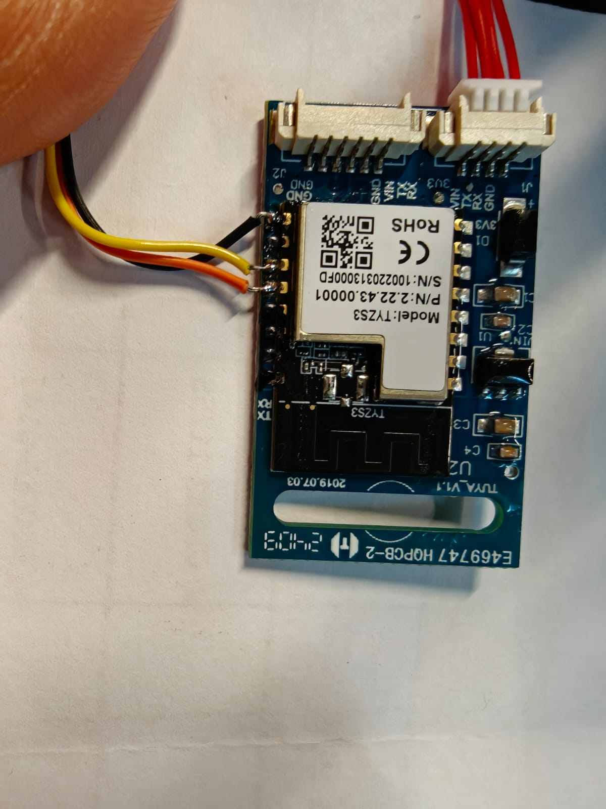
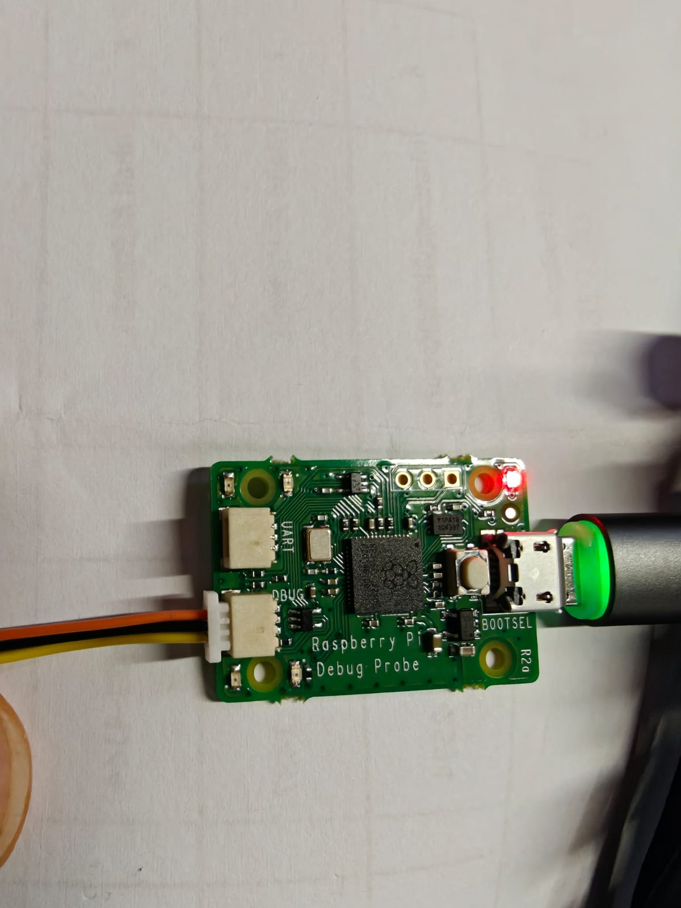

# Hardware & SWD wiring

You flash the TYZS3 module in place over its SWD pins, using a **Raspberry Pi Debug Probe** (R2a,
RP2040 CMSIS-DAP) driven by pyOCD.

> Simplicity Commander / Simplicity Studio will **not** talk to a CMSIS-DAP probe — they only
> speak SEGGER J-Link. That is why flashing is done with pyOCD.

## Module / SoC facts

- Module: **TYZS3**
- SoC: Silicon Labs **EFR32MG13P732** (Cortex-M4)
- Flash: `0x0`–`0x80000` (512 KB) · RAM base `0x20000000` (64 KB)
- Pin row (count in from the TX pad on that edge): `16 = TX, 15 = RX, 14, 13, 12 = SWCLK, 11 = SWDIO`
- Opposite row: `nRST = pin 1`, `VCC = pin 8`, `GND = pin 9`



*SWD leads soldered to the module: yellow = SWDIO (pin 11), orange = SWCLK (pin 12), black = GND (pin 9). The red JST on the carrier feeds 3.3 V.*

## Wiring: Debug Probe `DEBUG` port → TYZS3

Use the **DEBUG** JST-SH port (not the UART one). Standard cable colours:

| Debug Probe DEBUG | colour | TYZS3 pin |
|---|---|---|
| SWCLK | orange | pin 12 |
| SWDIO | yellow | pin 11 |
| GND   | black  | pin 9  |



*Flash from the probe's **DEBUG** port (not the UART one). Orange = SWCLK, yellow = SWDIO, black = GND.*

## Power and reset (the probe does neither)

- The Debug Probe's DEBUG port has **no power output and no reset line**.
- Power the module from a **3.3 V** source — a bench supply into the carrier `3V3` pin, or simply
  leave the module connected to the lock body so the lock powers it.
- **Common ground:** probe GND, the 3.3 V supply GND, and module pin 9 must all be tied together.
- If a plain connect is refused, use connect-under-reset: run a manual **nRST (pin 1) → GND** lead,
  hold it low, start the connect, and release just after.
- Flash with the **lock MCU disconnected** where possible, so it can't fight the SWD bus.

## Sanity check before flashing

```
pyocd list
```

should show the Raspberry Pi Debug Probe (CMSIS-DAP). The `Target` column reading `n/a` is normal
for CMSIS-DAP — it does not auto-identify the chip; a real connect with `-t efr32mg13p732f512gm48`
still works.

## Troubleshooting

- **`pyocd list` empty** — USB / driver issue; check the probe's own cable.
- **Connects but can't read flash** — the part is debug-locked; a mass-erase clears it
  (`pyocd erase --mass -t efr32mg13p732f512gm48`).
- **Flaky / no connect** — cold joint on SWDIO/SWCLK, no common ground, or the lock MCU is still
  wired and fighting the bus. Keep leads short.
